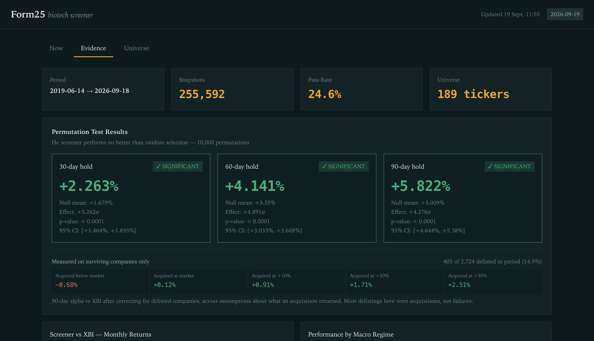

# Form25

**This started as a search for a profitable biotech strategy. It became an
investigation into why the result looked good — and how much of it was real.**

The screener works the way most do: filter US biotech on cash runway, cash
ratio and drawdown from the 52-week high, then hold what survives for 30, 60
or 90 days. Run over 2019–2026 it produced the number every backtest hopes for
— **p = 0.0000** against random selection, at all three horizons, across
255,592 daily snapshots.

That number is where the interesting part starts, because there were two
obvious reasons not to believe it.

**The first suspicion was COVID.** The strategy was developed over a window
containing the 2020–21 biotech run-up, when the whole sector went up and any
long-only screen would have looked clever. Segmenting the backtest by regime
was meant to confirm that and size the damage. **It did the opposite.** The
2022–2026 out-of-sample period — the biotech drawdown, the hard years — is the
*strongest* segment by Sharpe ratio, and the COVID window is the weakest. The
hypothesis was wrong, and the record of being wrong is kept below.

**The second suspicion was the data itself, and this one held.** Every company
in the price database was still trading. Not most of them — all 198 biotech
names (plus the two benchmark ETFs), across a small-cap cohort spanning the
2021 IPO wave and the 2022–23 collapse. A universe with zero attrition over
seven years isn't a clean dataset; it's a dataset assembled from the
survivors. Every company that went bankrupt, got acquired, or quietly delisted
had been erased before the backtest ever ran.

So the project changed shape: from *is this strategy profitable* to **how much
of an apparently significant result survives contact with the companies the
data left out** — and can that be measured without paying for commercial
survivorship-bias-free data.

It can. SEC EDGAR retains the dead companies; the reconstruction below is
built entirely from free filings. The short answer is that the bias is real
but smaller and stranger than expected — most of the missing companies were
*acquired*, not bankrupt, which cuts the correction and may even reverse its
sign.



The correction sits inside the same panel as the significance test on purpose:
a caveat on its own tab is a caveat nobody reads.

**[Open the dashboard →](https://spongebob959.github.io/form25/)**

---

## Headline findings

| | |
|---|---|
| Universe attrition, 2019–2026 | **14.9%** (405 of 2,724 biotech companies delisted) |
| Of those delistings | **69.6% acquisitions**, 19.8% undetermined, **10.6% bankruptcies** |
| Reported 90-day alpha vs XBI | +2.27% |
| Same alpha, survivorship-corrected | **−0.53% to +2.58%**, depending on what an acquisition returned |
| Score model rank correlation | **ρ = 0.008** — the scoring layer had no predictive value, and has been removed |
| Strongest regime segment | **2022–2026 out-of-sample**, not the 2020–21 COVID window |

Four results are worth stating plainly. Three of them contradict what the
project believed when it started, including both of its opening suspicions.

**1. The COVID hypothesis was wrong — the first suspicion did not survive.**
The expectation was that the 2020–21 biotech run-up inflated the record.
Segmenting by regime shows the reverse: the out-of-sample 2022–2026 period,
containing the biotech drawdown, is the *strongest* segment by Sharpe ratio
(0.21), and the COVID window is the weakest (0.09). Had the edge been a COVID
artefact, it would have decayed out-of-sample. It strengthened.

**2. The survivorship suspicion held — but the standard correction is wrong
for this universe.** The CRSP convention assigns −30% to a delisting of
unknown cause, encoding the assumption that leaving the market is a failure.
In US biotech between 2019 and 2026 it mostly wasn't: acquisitions outnumbered
bankruptcies roughly seven to one. Applying the textbook correction to this
cohort overstates the penalty by more than 4 percentage points and turns a
positive result negative. Weighting the correction by the *observed* mix of
delisting reasons matters more than any other single assumption here.

**3. Survivorship bias here may run in both directions.**
The textbook case assumes the missing companies are losers, so excluding them
inflates returns. When 70% of exits are acquisitions — typically at a premium
— excluding them can *understate* returns. Which direction dominates depends
on the acquisition premium, the one quantity this analysis could not measure
and had to bound instead.

**4. The scoring model contributed nothing, so it is gone.**
Spearman ρ between soft score and forward return was 0.008. The binary hard
filters beat random selection; the score that ranked companies within the
passing set did not. A null result, reported rather than buried — and then
acted on: the scoring layer has been deleted rather than left in the codebase
looking load-bearing. The screen is now the hard filters alone, and the
companies that pass are listed alphabetically, because passing is binary and
any ordering would imply a conviction the evidence does not support.

---

## Reconstructing a point-in-time universe from SEC EDGAR

The core methodological problem: answering *which companies existed at the
time* without a commercial data subscription.

The project's original universe came from current ETF holdings and a ticker
API filtered to `active=true`. Both return today's survivors. The local price
database made this visible — all 200 tickers had bars running to the present
day, and a biotech cohort spanning the 2021 IPO wave and the 2022–23 drawdown
with *zero* attrition is not a clean dataset.

SEC EDGAR retains the companies that are gone; they are simply reachable by a
different route than the one most tooling uses.

| Question | Source | Works for dead companies |
|---|---|---|
| Which companies existed? | `browse-edgar` filtered by SIC code | yes |
| When did it stop trading? | Form 25 / 25-NSE, Form 15 | yes |
| Why did it stop? | 8-K Item 1.03 (bankruptcy) | yes |
| What was its ticker? | Last 10-K cover page | ~77% |

The standard entry point, `company_tickers.json`, lists only current
registrants — Clovis Oncology, Sorrento, Athersys and Zosano are all absent
from it. Querying by SIC code instead returns every company that ever filed
under that classification, dead ones included.

Two failure modes were found by running against live EDGAR rather than fixtures:

- **A Form 25 is not a death certificate.** It is filed whenever any class of
  security leaves an exchange — an expiring warrant, a maturing note, a
  transfer between NYSE and Nasdaq. Treating it at face value marked **Amgen,
  ADMA and Brainstorm as delisted**. Killing off live companies corrupts a
  backtest exactly as badly as ignoring dead ones, in the opposite direction.
  Delisting detection now requires that periodic filings actually *stopped*.

- **`filings.recent` truncates at ~1,000 filings.** Long-lived filers spill the
  remainder into paginated files, so a company's first filing date read years
  too late — which would have screened live companies out of early backtest
  days.

Ticker recovery is the weakest link. Deregistration clears the ticker from
SEC's own metadata, so it has to be parsed back off the cover page of the
company's final 10-K. That succeeds for about 77% of delisted names, and the
failures concentrate in pre-2010 shells rather than the recent names that
matter most here.

**Cost: nothing.** No API key, no subscription. The commercial equivalents
(Sharadar, EODHD, Norgate, CRSP) run $20–50/month.

---

## What the backtest reports, and what survives correction

255,592 daily snapshots, 189 tickers, 1,826 trading days, 2019-06-14 →
2026-09-18. A permutation test against random selection from the same
universe, 10,000 iterations.

| Hold | Screener | Random | p | Effect | Sharpe | Win rate | Median |
|---|---|---|---|---|---|---|---|
| 30d | +2.26% | +1.68% | 0.0000 | +5.26σ | 0.19 | 46.6% | −1.33% |
| 60d | +4.14% | +3.35% | 0.0000 | +4.89σ | 0.16 | 45.8% | −2.57% |
| 90d | +5.82% | +5.01% | 0.0000 | +4.28σ | 0.15 | 45.6% | −3.48% |

These are the numbers the dashboard shows, because it now reads this saved
report rather than restating it. It previously carried its own hardcoded copy
from an earlier run and displayed a 90-day mean of +7.55% against the report's
+5.82%. The README blamed "different filtering paths"; the filtering paths
were in fact identical, and recomputing from the snapshot cache reproduces
+5.822% exactly. The constants had simply been frozen while the data moved on.

The p-values are not the interesting number. With n ≈ 62,000 observations a
0.58pp gap is trivially detectable; the p-value measures sample size as much
as effect. Sharpe around 0.17 and a **negative median at every horizon** are
more informative: the strategy loses on most trades and is carried by a small
number of large winners — the characteristic biotech payoff, and the shape
most exposed to survivorship bias, because the missing companies are
concentrated in the losing tail.

### Against a benchmark anyone could buy

Beating random selection *inside a biotech universe* is a weaker claim than
beating the sector ETF. Measured over the same trading days:

| Hold | Screener | XBI | SPY | vs XBI | vs SPY |
|---|---|---|---|---|---|
| 30d | +2.26% | +1.11% | +1.34% | **+1.15%** | +0.92% |
| 60d | +4.14% | +2.26% | +2.69% | **+1.88%** | +1.45% |
| 90d | +5.82% | +3.55% | +4.08% | **+2.27%** | +1.74% |

That +2.27% decomposes in a way that matters:

```
screener vs XBI          +2.27pp
  random pick vs XBI     +1.46pp   ← the universe, not the screener
  screener vs random     +0.81pp   ← actual screening skill
```

Random selection *within the surviving universe* already beats XBI by 1.46pp.
That is precisely the artifact survivorship bias predicts: an index holds its
failures, a survivors-only universe does not. So roughly two-thirds of the
apparent alpha is attributable to the sample, not the strategy.

### The correction

Attrition of 14.9%, weighted by the measured mix of delisting reasons
(bankruptcy −100%, unknown −30%, acquisition variable):

| If an acquisition returned | Blended delisting return | Corrected 90d alpha |
|---|---|---|
| Below market (−10%) | −23.5% | −1.56% |
| At market (0%) | −16.5% | −0.53% |
| +10% premium | −9.6% | +0.51% |
| +20% premium | −2.6% | +1.54% |
| +30% premium | +4.3% | +2.58% |

For reference, a flat −30% CRSP convention would report −2.54%.

**The conclusion depends almost entirely on the acquisition premium**, because
acquisitions are 70% of the cohort. Below roughly +5% the edge disappears;
above +20% most of it survives. Biotech takeouts commonly close well above
+20%, so the likely answer is that the edge partly survives — but this
analysis does not establish that, and says so rather than picking the
convenient assumption.

### Does the screen avoid companies that fail?

The bounds above assume no skill at avoiding doomed companies. The hard
filters threshold on cash runway and cash ratio, which are bankruptcy-avoidance
criteria by construction, so this is testable.

For four confirmed bankruptcies, cash runway six months before delisting:

| | 24mo | 12mo | 6mo | Passes ≥6mo filter? |
|---|---|---|---|---|
| Clovis Oncology | 10.6 | 9.9 | 6.9 | **admitted** |
| Sorrento | 4.1 | 1.7 | 2.6 | blocked |
| Athersys | 7.8 | 2.5 | 0.7 | blocked |
| Zosano | 6.8 | 9.8 | 6.7 | **admitted** |

Dying companies passed at 50% against a 64.6% baseline for live companies —
partial skill, but the filter would still have bought Clovis and Zosano with a
clean bill of health six months before bankruptcy. **n = 4; this is indicative
only** and is the weakest claim in this document.

### By regime

| Segment | 30d edge over random | p | Sharpe |
|---|---|---|---|
| Pre-COVID (2019) | +0.63pp | 0.139 | 0.27 |
| COVID (2020–21) | +0.92pp | 0.0000 | 0.09 |
| Out-of-sample (2022–26) | +0.49pp | 0.0000 | 0.21 |

The out-of-sample window holds up and is the strongest by Sharpe. Note that it
is also the period where biotech delistings clustered, so it is simultaneously
the most contaminated segment — the strongest evidence and the least clean
evidence are the same data.

---

## Known limitations

**Delisted companies still have no prices.** The universe reconstruction
identifies them and dates their exit, but no free source provides price
history for delisted US equities — yfinance returns nothing for five of six
test tickers, and Stooq gates its CSV endpoint. The backtest therefore still
runs on survivors, and the correction above is an analytical bound rather than
a re-run. Closing this needs a paid feed.

**Ticker recycling is a live hazard.** Sorrento delisted in April 2023, yet
yfinance returns SRNE bars through 2026 belonging to a different company that
later took the symbol. Backfilling by symbol would splice a live company's
returns onto a dead one's identity — worse than the original bias.
`data/ticker_recycling.py` guards against this, keyed on the universe table
rather than the ticker.

**Delisting reasons are heuristic.** Derived from filing patterns, not from
deal documents. The bankruptcy/acquisition split drives the correction, and it
is inferred rather than verified. Deal terms are available in SEC merger
filings (8-K, DEFM14A) — this is the highest-value unfinished work, and it is
free.

**Foreign private issuers are excluded.** Nine tickers file 20-F/6-K rather
than 10-K/10-Q, and the filing-timeline parser reads only the latter. A
selection gap of about 4.5% of the universe, skewed toward US-incorporated
companies.

**`listed_from` is the first SEC filing, not the IPO.** Companies file
privately for years first. It is deliberately a conservative floor — it can
only exclude days a company demonstrably did not exist — but it is not a
listing date.

---

## Reproducing this

```bash
git clone <repo> && cd form25
python -m venv .venv && source .venv/bin/activate
pip install -r requirements.txt
cp .env.example .env          # set FRED_API_KEY and SEC_CONTACT_EMAIL
```

`SEC_CONTACT_EMAIL` is required: SEC Fair Access wants a contact address in
the User-Agent of automated requests, and any EDGAR fetch refuses to run
without one rather than sending a fake address and getting throttled.

```bash
python form25.py setup                     # prices, macro, CIK cache (~2h first run)
python data/fetch_delistings.py            # SEC universe reconstruction (~2h, resumable)
python form25.py backtest --save-report    # defaults to 2019-06-14 → 2026-09-18
python scripts/survivorship_bounds.py --observed-return 2.27
python form25.py cache --force             # analysis cache for the dashboard
python form25.py export                    # writes dashboard/form25.html + docs/
python -m unittest discover tests
```

Every command defaults to the same window the published results were computed
over; it is defined once, in `utils/config.py`.

The delisting scan is rate-limited to SEC's 10 requests/second ceiling and
caches every CIK as it resolves, so an interrupted run resumes where it
stopped rather than starting over.

Re-running analysis on existing snapshots is fast — pass `--stats-only` to
skip the rebuild.

---

## Layout

```
backtest/       snapshot engine, filing timelines, permutation tests
data/           price, macro, universe fetchers
                fetch_delistings.py    — point-in-time universe from EDGAR
                ticker_recycling.py    — recycled-symbol guard
screener/       hard filters (the entire screen)
scripts/        setup, backtest runner, dashboard export
                survivorship_bounds.py — bias bounds without paid data
sec/            EDGAR fetcher and parser
dashboard/      self-contained HTML dashboard
tests/          40 tests, no network required
```

Secrets live in a gitignored `.env`; `.env.example` documents the variables.
The survivorship analysis needs no credentials.

---

## What this project ended up being

It set out to find a profitable strategy. It did not find one that can be
claimed with confidence, and saying so is the result rather than a failure to
report one.

What it did produce is a measurement: how much of an apparently significant
backtest survives contact with the companies the data quietly left out. A
+2.27% alpha against XBI, corrected for 14.9% attrition weighted by the
observed mix of delisting reasons, lands somewhere between −0.53% and +2.58%.
The remaining uncertainty sits almost entirely in one quantity — the average
acquisition premium — that is measurable from SEC merger filings and has not
been measured yet.

Both opening suspicions were tested rather than assumed. One was wrong: COVID
was not inflating the result, and the edge is strongest in the out-of-sample
years. One was right, but smaller and stranger than expected: the universe was
survivors-only, yet most of the missing companies were acquired rather than
bankrupt, so the correction is milder than the textbook one and might run the
other way entirely.

The strategy is not the deliverable. The measurement is.
